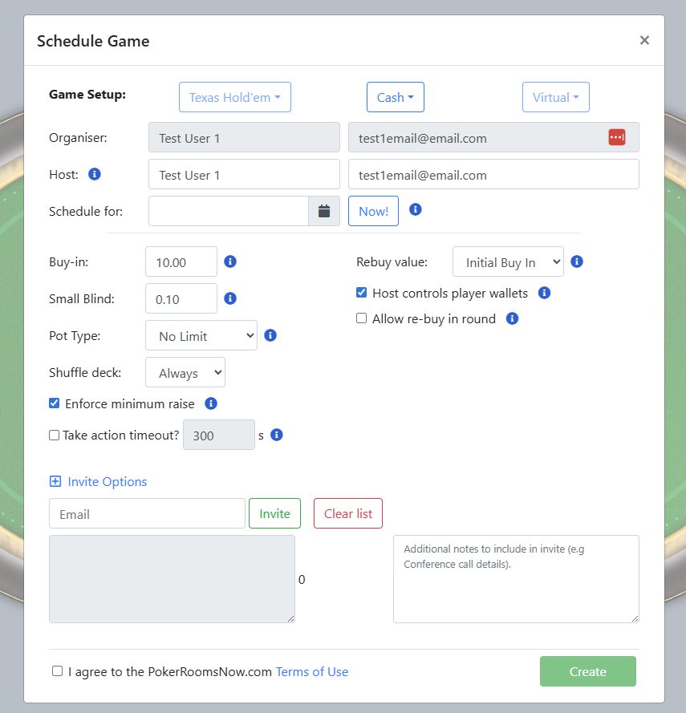
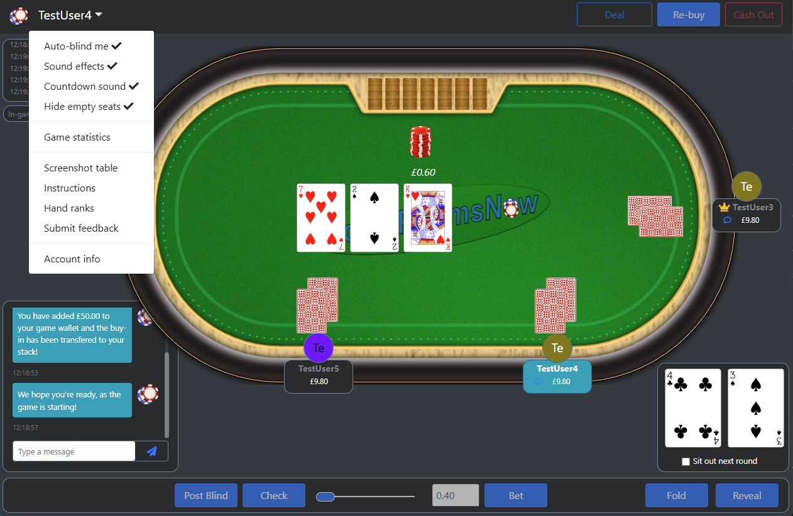

# Poker Rooms Now #

Play Texas Hold 'em at home with friends! (Assuming you host these services somewhere accessible)

To run the application you need to build and deploy the two main microservices (App and Core). Also included are the Gateway and Service Discovery, but these could be replaced if you want to run it Kubernetes et al.
The application uses ElasticSearch for storage (hand/ player history) and WebSockets for communicating with the front-end in realtime.
The front-end is Javascript with Bootstrap, which is rolled as static resources in the App service.

To get a feel for the application, build PokerNights-App and run ```java -Dspring.profiles.active=dev -jar poker-nights-app-0.1.0-SNAPSHOT.jar``` on the CLI.

For immediate visibility and testing, go to http://localhost:8080/texas/test and take a seat at the table.
You can then open a new tab, take a different seat with a different name and then the dealing will be enabled [for the first player].

The application includes statistics, hand history, user invites, chat functionality and various other facilities that make this a complete application.

When I get a bit more free time I hope to update this project to modern versions and hosting it within Kubernetes.







## A little history...

### Creation
I orginally developed this application back in 2020/21 during Covid so my friends and I could continue our bi-weekly poker games whilst we (along with the rest of the UK) were sat at home.
At the time, I searched around for online poker sites that were cheap to play and retained the 'friendly' feel of a home game, but unsurprisingly they were all geared to making money for the site owner - the most irritating element to me was that they all charged a rake. If you play with friends for fun, this is a show-stopper.

I set about making my own application and this code-base is the result. The main component I wanted to keep alive was the social aspect of the game, so this application includes a few differences to 'standard' online sites:

* There is a 'host' - Like the mate who's house you're at, they set the House Rules.
* Easy hosting and quick set-up. Enable anyone to host and play a private game of Texas Hold'em with friends, with the minimal amount of set-up required and no need to download or install any additional software.
* Only focus on private games. We are not a casino or gambling web site - we provide our Software as a Service for you to play the online equivalent of a private home game.
* Transparent pricing. There are No rake fees! All games have a fixed hosting fee for up to 12 hours play (post-launch).
* Keep it social. A good home game is as much about the social as it is about the poker, therefore there are no timers to force you in to action or distract you from a conversation.. As we don't charge a rake-fee, we don't mind how many rounds you play... 5 or 500, leaving more time for banter.
* Keep it fun. There are no big-money pay-outs and no professional players in your game (unless you invite them), so you can be assured that no one is there just to earn money from you.
* Cash game or Tournament options are avilable.

All Texas Hold 'em mechanics are standard and winner(s)/ pay-outs are calculated automatically.

### Testing and Use

Over the course of development, my friends and I played 20+ games with the software, whilst it was hosted on an AWS VM.
When I changed jobs to a small company (and it was still Covid), myself and colleagues played ~10 games on the software.
I wouldn't say it's bullet-proof, but it has had a fair degree real-world testing. 

One of the hardest parts to the application was getting the 'winning hand' calculations correct - After trying various mechanisms I ported some of Daniel Paz's Poker Hand Evaluator https://github.com/danielpaz6/Poker-Hand-Evaluator and based the hand evaluation on Kevin Suffecool's 5-card hand evaluator with Paul Senzee's pre-computed hash.

### Shut-down :(

In 2021 I explored whether there was any chance of launching Poker Nights as a paid service, but after investigations into licensing via the Gambling Commission, and the cost of marketing the product, I decided it wouldn't be possible without backing.
In early 2022 my free AWS credits ran out and it was costing ~£25 per month to keep the service running which, given the possiblity of launching the product, I deemed not worth it, especially as we had resumed in-person games.

### Today

So now it's 2026 and the codebase has been hanging around on my hard drive for a while. I don't have any personal projects on Github, so I thought I would create this one and a) allow anyone to do whatever they like with a fully working Poker app, and b) use it advertise my reasonable Java skills!
I've written this history so anyone who looks through the code and judges it, knows that it's a home project that's now a few years off the most recent versions of Java and my skillset!

If you find it useful, then it's all good with me.

### How do I get set up? ###

* Build the parent project
* Build the root project (with sub-modules)
* Run the poker-nights-app with the ```dev``` profile.
* http://localhost:8080/

### Contribution guidelines ###

* Please message me if you're interested in providing updates
